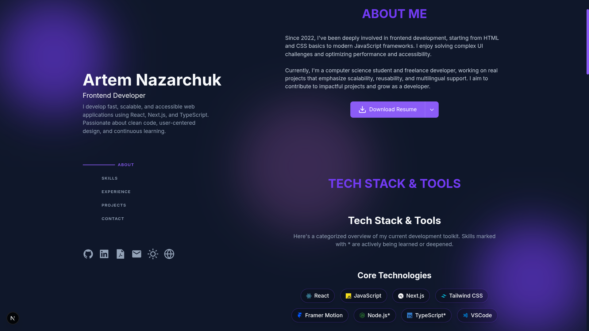
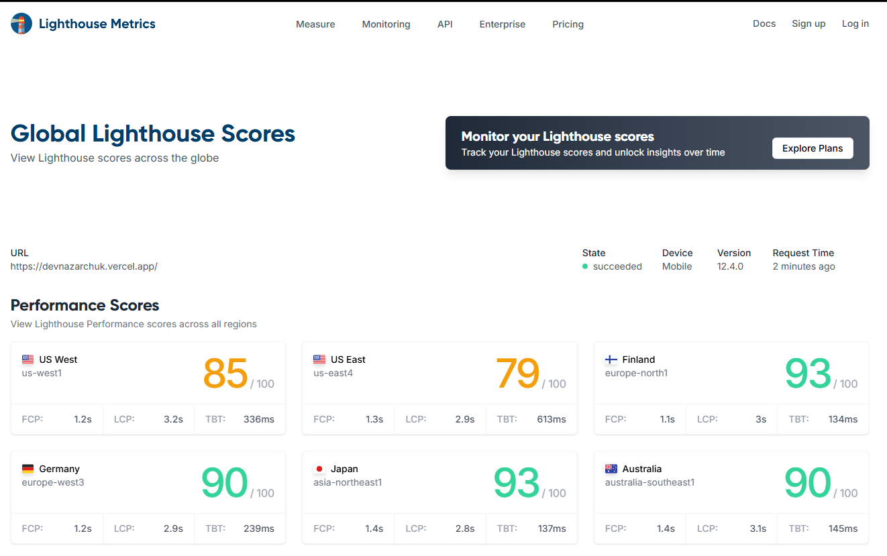

<p align="center">
   
  
</p>

<p align="center">
  <a href="https://lighthouse-metrics.com/lighthouse/checks/4c98d856-a1ff-4e85-8f79-78d247924af2">
    
  </a>
</p>


# Artem Nazarchuk - Portfolio Website

A modern, responsive portfolio website built with Next.js 14, showcasing my work as a Frontend Developer. The site features a beautiful UI with smooth animations, dark/light theme support, and multilingual capabilities (English/German).

## 🌟 Features

### Core Features
- **Modern Tech Stack**
  - Next.js 14 with App Router
  - TypeScript for type safety
  - Tailwind CSS for styling
  - Framer Motion for animations
  - EmailJS for contact form

- **User Experience**
  - Responsive design for all devices
  - Smooth page transitions
  - Interactive UI elements
  - Custom cursor effects
  - Beautiful gradient backgrounds
  - Smooth scrolling behavior
  - Section-based navigation

- **Internationalization**
  - Full English/German language support
  - Language persistence using localStorage
  - Translated content for all sections
  - Dynamic language switching
  - RTL support ready

- **Theme Support**
  - Dark/Light mode
  - Theme persistence using localStorage
  - Smooth theme transitions
  - Custom color scheme
  - System theme detection

- **Performance & SEO**
  - Optimized images
  - Fast page loads
  - SEO-friendly metadata
  - Sitemap generation
  - OpenGraph support
  - Google verification
  - Robots.txt configuration

## 📁 Project Structure

```
app/
├── api/                    # API routes
│   └── sitemap/           # Sitemap generation
│
├── context/               # React context providers
│   ├── LanguageContext.tsx    # Language management
│   └── ThemeContext.tsx       # Theme management
│
├── lib/                   # Utility functions
│   ├── animation.ts          # Animation configurations
│   └── data.ts              # Project data
│
├── messages/              # i18n translations
│   ├── en.json              # English translations
│   └── de.json              # German translations
│
├── ui/                    # Reusable components
│   ├── about.tsx            # About section
│   ├── chip.tsx             # Tag component
│   ├── contact.tsx          # Contact section
│   ├── contactForm.tsx      # Contact form
│   ├── cursor.tsx           # Custom cursor
│   ├── experience.tsx       # Experience section
│   ├── experienceCard.tsx   # Experience card
│   ├── header.tsx           # Navigation header
│   ├── link.tsx             # Navigation link
│   ├── projectCard.tsx      # Project card
│   ├── projects.tsx         # Projects section
│   ├── skills.tsx           # Skills section
│   └── skillTimeline.tsx    # Skills timeline
│
├── projects/              # Project pages
│   └── [slug]/            # Dynamic project routes
│
├── globals.css            # Global styles
├── layout.tsx             # Root layout
└── page.tsx               # Main page
```

### Key Components

#### UI Components
- **About Section** (`about.tsx`)
  - Personal introduction
  - Resume download options
  - Language-specific content

- **Contact Section** (`contact.tsx`, `contactForm.tsx`)
  - EmailJS integration
  - Form validation
  - Success/error handling
  - Loading states

- **Experience Section** (`experience.tsx`, `experienceCard.tsx`)
  - Work history
  - Company details
  - Technology stack
  - Timeline view

- **Projects Section** (`projects.tsx`, `projectCard.tsx`)
  - Project showcase
  - Live demos
  - GitHub links
  - Technology tags

- **Skills Section** (`skills.tsx`, `skillTimeline.tsx`)
  - Technology timeline
  - Skill categories
  - Progress visualization

#### Context Providers
- **Language Context** (`LanguageContext.tsx`)
  - Language state management
  - Language switching
  - Persistence handling

- **Theme Context** (`ThemeContext.tsx`)
  - Theme state management
  - Theme switching
  - System theme detection

## 🚀 Getting Started

1. Clone the repository:
   ```bash
   git clone https://github.com/devnazarchuk/portfolio.git
   ```

2. Install dependencies:
   ```bash
   npm install
   ```

3. Create a `.env.local` file with required environment variables:
   ```
   NEXT_PUBLIC_EMAILJS_PUBLIC_KEY=your_public_key
   NEXT_PUBLIC_EMAILJS_SERVICE_ID=your_service_id
   NEXT_PUBLIC_EMAILJS_TEMPLATE_ID=your_template_id
   ```

4. Run the development server:
   ```bash
   npm run dev
   ```

## 🛠️ Technologies Used

### Frontend
- **Framework**: Next.js 14
- **Language**: TypeScript
- **Styling**: Tailwind CSS
- **Animations**: Framer Motion
- **Icons**: React Icons
- **Email**: EmailJS

### Development & Deployment
- **Version Control**: Git
- **Hosting**: Vercel
- **Package Manager**: npm
- **Code Quality**: ESLint, Prettier

## 📱 Responsive Design

The website is fully responsive and optimized for:
- Desktop (1920px and below)
- Tablet (1024px and below)
- Mobile (768px and below)
- Small Mobile (425px and below)

### Responsive Features
- Mobile-first approach
- Fluid typography
- Adaptive layouts
- Touch-friendly interactions
- Optimized images
- Responsive navigation

## 🌐 Live Demo

Visit the live website at [devnazarchuk.vercel.app](https://devnazarchuk.vercel.app)

## 📄 License

This project is open source and available under the [MIT License](LICENSE).

## 👨‍💻 Author

- **Artem Nazarchuk**
  - GitHub: [@devnazarchuk](https://github.com/devnazarchuk)
  - LinkedIn: [Artem Nazarchuk](https://www.linkedin.com/in/devnazarchuk/)
  - Email: devnazarchuk@gmail.com
